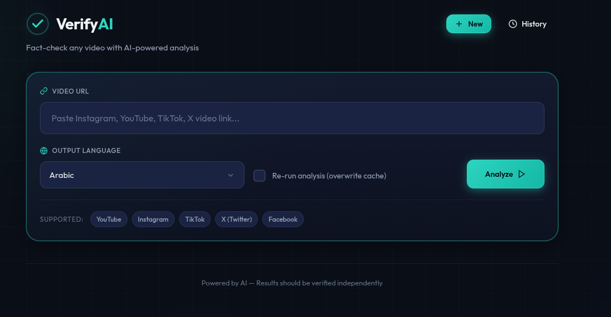
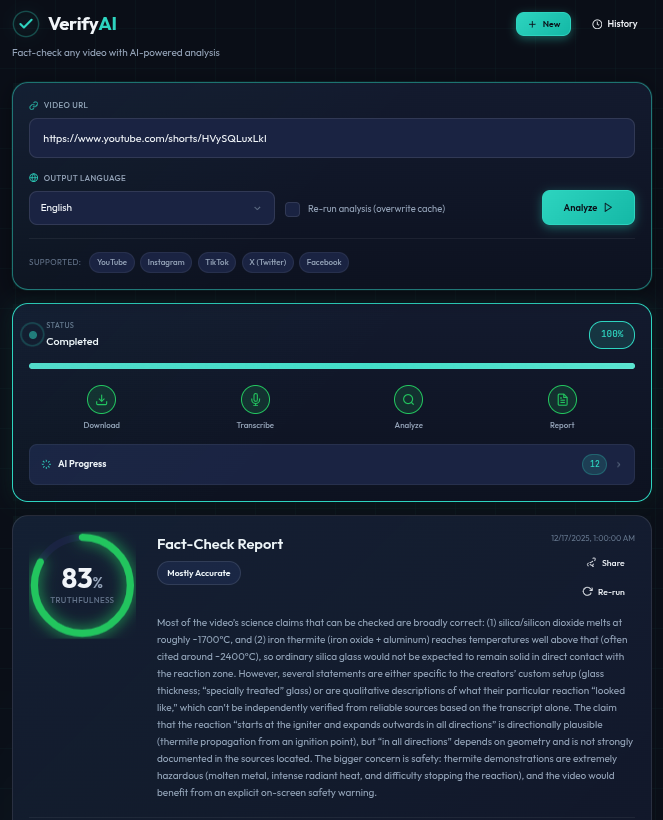
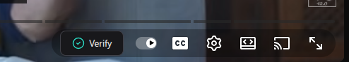
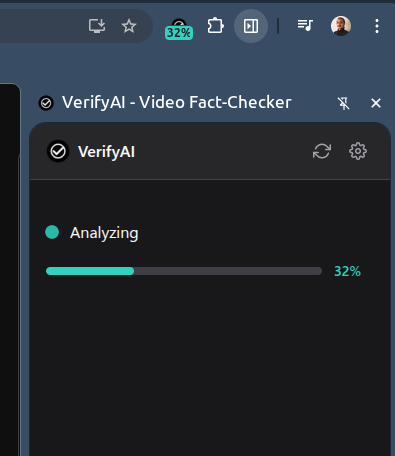
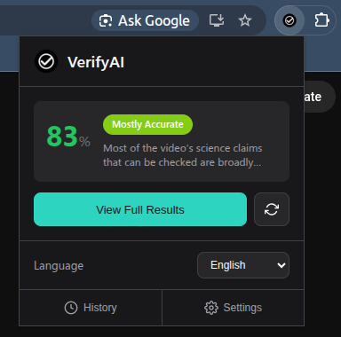

# VerifyAI — Fact-Check Social Media

End-to-end platform to fact-check social media videos from YouTube, Instagram, TikTok, X/Twitter, and more.

<p align="center">
  
</p>

## ✨ Features

- **Multi-platform support** — YouTube, Instagram, TikTok, X/Twitter, Facebook via `yt-dlp`
- **30+ output languages** — Arabic, English, French, Spanish, and many more
- **Smart caching** — Results saved per URL+language; re-run to refresh
- **Weighted scoring** — Central claims impact the score more than minor ones
- **Claim-by-claim analysis** — Each claim verified with sources and confidence levels
- **History panel** — Browse and revisit previously analyzed videos
- **Browser extension** — Analyze videos directly from YouTube/Instagram with one click

### AI Providers

| Function | OpenAI | Gemini |
|----------|--------|--------|
| Transcription | `gpt-4o-transcribe` | `gemini-2.5-flash`, `gemini-2.5-pro` |
| Fact-checking | `gpt-5.2-2025-12-11` | `gemini-2.5-flash`, `gemini-2.5-pro`, `gemini-3-pro-preview` |

Configure via `TRANSCRIBE_MODEL` and `FACTCHECK_MODEL` environment variables.

---

## 🚀 Quick Start

### Prerequisites

- Python 3.10+
- `ffmpeg` — required by `yt-dlp` for audio extraction
  ```bash
  # macOS
  brew install ffmpeg
  
  # Ubuntu/Debian
  sudo apt install ffmpeg
  ```

### Installation

```bash
git clone https://github.com/user/Fact-Check-SocialMedia.git
cd Fact-Check-SocialMedia

python -m venv .venv
source .venv/bin/activate
pip install -r requirements.txt

cp .env.example .env
# Edit .env with your API keys
```

### Run

```bash
uvicorn app.main:app --reload
```

Open [http://127.0.0.1:8000](http://127.0.0.1:8000)

### Docker

```bash
export OPENAI_API_KEY=sk-...
export GEMINI_API_KEY=...  # optional, only if using Gemini models
docker compose up --build
```

---

## 📸 Screenshots

### Analysis Results

<p align="center">
  
</p>

Detailed fact-check report with truthfulness score, claim-by-claim breakdown, and sources.

### Browser Extension

<table>
  <tr>
    <td align="center">
      <br>
      <em>Verify badge on video player</em>
    </td>
    <td align="center">
      <br>
      <em>Side panel during analysis</em>
    </td>
    <td align="center">
      <br>
      <em>Extension popup with results</em>
    </td>
  </tr>
</table>

---

## 🧩 Browser Extension

The browser extension lets you fact-check videos directly from YouTube, Instagram, and other sites without leaving the page.

### Prerequisites

- Node.js 18+
- Backend running on `http://127.0.0.1:8000` (configurable in extension settings)

### Build

```bash
cd extension
npm install

npm run dev            # Watch mode for Chrome
npm run build:chrome   # Production Chrome build
npm run build:firefox  # Production Firefox build
```

### Chrome

1. Run `npm run dev` or `npm run build:chrome`
2. Go to `chrome://extensions` → Enable **Developer Mode**
3. Click **Load unpacked** → Select `extension/dist/chrome`
4. Navigate to a video and click the VerifyAI badge or toolbar icon

### Firefox

1. Run `npm run build:firefox`
2. Go to `about:debugging#/runtime/this-firefox`
3. Click **Load Temporary Add-on…** → Select `extension/dist/firefox/manifest.json`
4. Navigate to a video to see the injected badge

### Troubleshooting

- **Stuck at "Analyzing"?** Check your backend `.env` has a valid model (e.g., `FACTCHECK_MODEL=gpt-4o-mini`)
- **Firefox issues?** Always load from `dist/firefox` (not `src/`) due to `_locales` requirements
- **Debug logs?** Use `about:debugging` → **Inspect** to open the extension console

---

## ⚠️ Important Notes

### Security

> **API Key Safety**: Never paste API keys in chat or commit them to git. If exposed, rotate immediately in your provider's dashboard.

### Legal & Usage

- Downloading content may be restricted by platforms or violate their terms. Only use content you have rights to access.
- For some Instagram reels, you may need cookies via `YTDLP_COOKIES_FILE`.

### Long Videos

Audio is automatically chunked into 15-minute segments and transcribed in parallel. Configure with:
- `TRANSCRIBE_CHUNK_SECONDS` — Segment duration (default: 900)
- `TRANSCRIBE_MAX_WORKERS` — Parallel transcription workers

---

## 📄 License

MIT
